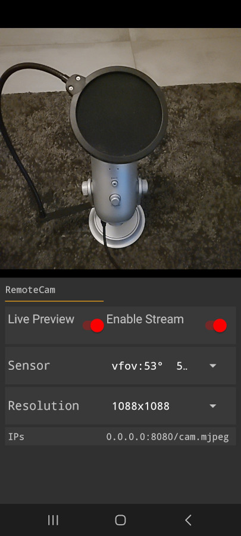
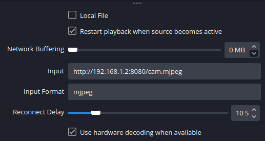

# RemoteCam
Your android camera streamed on your desktop: use as a source for OBS, or as a webcam with v4l2.

# How it works
The app allows a user to choose a sensor and a resolution. From there it captures every frame as JPEG and push them to a connected http client as a MJPEG stream.

# Use cases
You can use that stream in **OBS** with the *Media Source* or the *Browser* (lower latency) source: (change ip to your phone's)

Or you can pipe the stream into a virtual webcam compatible with most apps. On linux you would use **v4l2** and **ffmpeg**.
see bash script **remoteCamClient** for an example of how to set that up.

# Client
No official client yet, you have to DIY your way with the provided http MJPEG stream for now.
Let me know your interest for a turnkey virtual webcam or OBS plugin.

# Why
There is already an alternative, Droidcam, but it is not free for HD resolution 720p+.
Also Droidcam cannot use the telephoto lens on Samsung devices.

RemoteCam is an opensource alternative to Droidcam (but with <10% of its functionalities). 